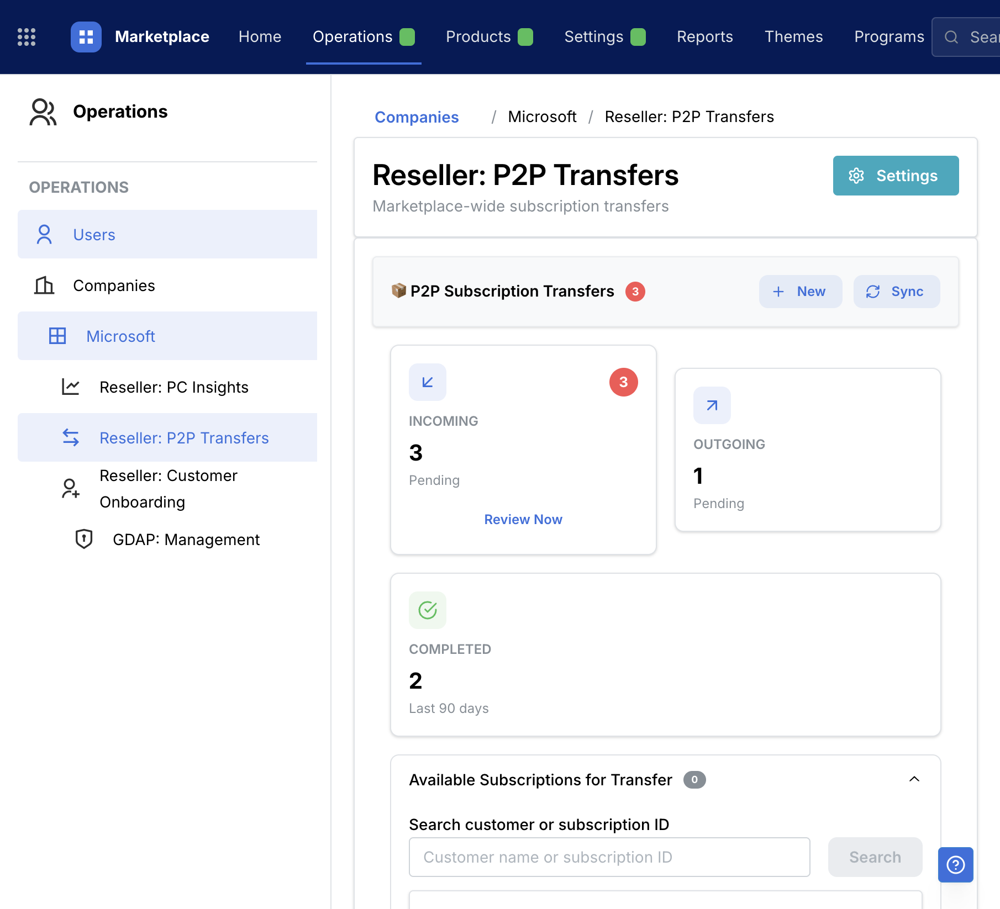
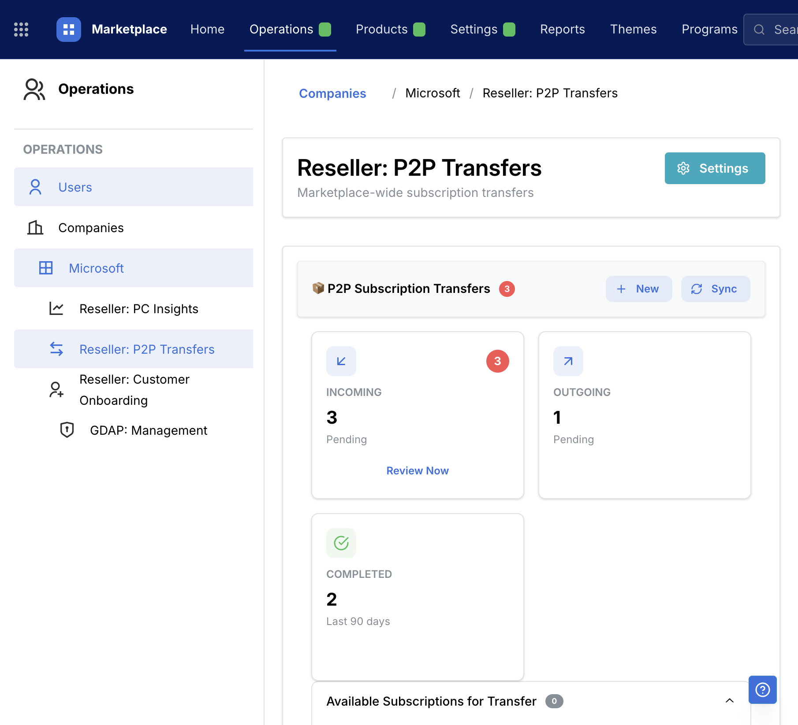
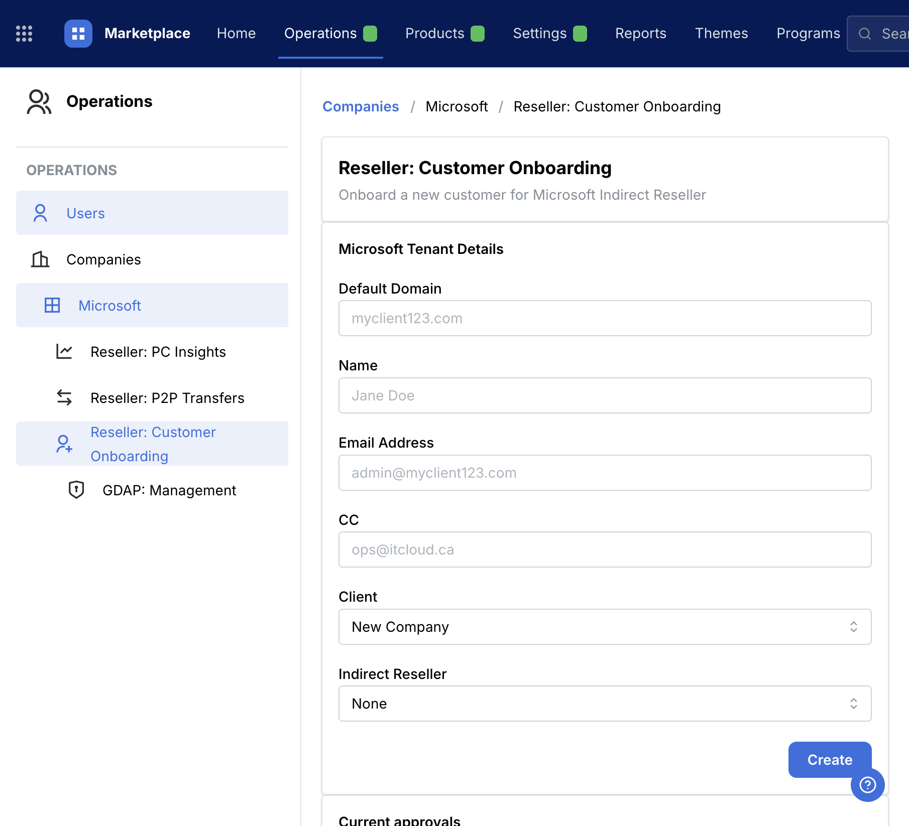
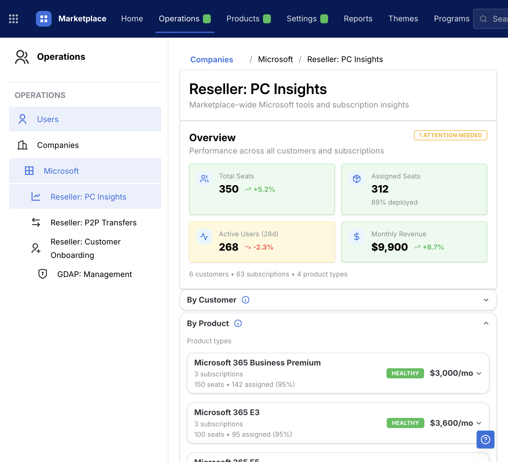
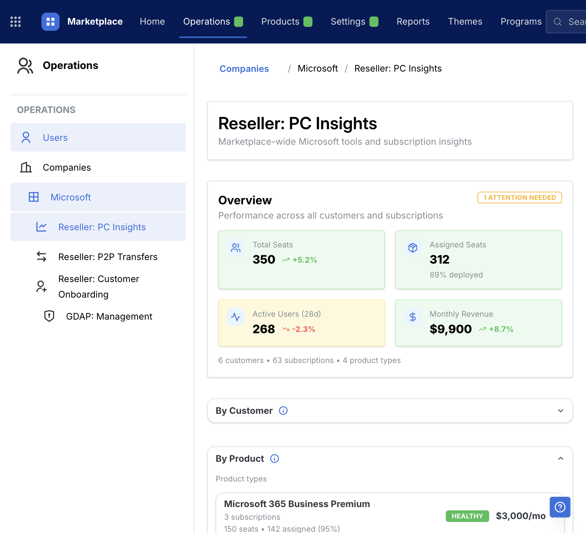

# UX Feedback — Operations/Microsoft spacing + card consistency (P2P, Onboarding, Reseller)

**Area**: Operations → Microsoft  
**Pages**: Reseller: P2P Transfers, Reseller: Customer Onboarding, Reseller: PC Insights  
**Context**: App uses the updated Mantine-native DesignSystem patterns; pages should be **tight but not cramped** with consistent spacing primitives.  
**Date**: 2026-01-21  
**Author**: Neil Bolton / Cursor agent notes consolidated

---

## Executive summary

Several Operations/Microsoft pages still had **inconsistent card sizing/spacing** because they were using:

- **Manual layout primitives** (ad-hoc grids / wrapper divs / raw margins) instead of a standard page flow.
- **Cards that change height based on conditional content**, producing uneven rows.
- **Non-wrapping action rows** that compress at narrower widths.
- **Tables without horizontal overflow policy**, forcing cramped columns or awkward wrapping.

The fix was to apply the same layout discipline used on GDAP:

- Use a consistent **page flow**: `<main>` + `Stack gap="xl"` + section `Card`s.
- Use `SimpleGrid` for summary/metric cards.
- Ensure action rows wrap (`wrap="wrap"`) and inputs have minimum width.
- Apply a standard “tables can scroll horizontally” rule (`overflowX: auto`).

---

## Repro (what we saw)

1. Open:
   - `/operations/microsoft/p2p`
   - `/operations/microsoft/onboarding`
   - `/operations/microsoft/reseller`
2. Observe:
   - P2P summary cards appear **uneven** (one card grows because it includes an extra action button).
   - Onboarding fields use a manual grid and can feel **compressed** under width changes.
   - Reseller overview metrics use a manual grid; spacing is inconsistent with other cards.

---

## Before / After screenshots

### P2P — Before / After

### Onboarding — Before / After

### Reseller — Before / After

---

## Changes applied (implementation)

### A) P2P Transfers

- **Summary cards**: replaced `Group wrap="wrap"` layout with Mantine `SimpleGrid` for predictable alignment.
- **Card height consistency**: reserved space for the optional action button so cards align vertically.
- **Action rows wrap**: header actions now `wrap="wrap"`.
- **Tables overflow**: eligible subscriptions table wrapped with `overflowX: auto`.

**Reference files**:
- `src/pages/OperationsP2PTransfers.tsx`
- `src/components/company/p2p/P2PTransfersPanel.tsx`

### B) Customer Onboarding

- **Form layout**: replaced manual CSS grid with `SimpleGrid cols={{ base: 1, sm: 2 }}`.
- **Table overflow**: approvals table wrapped with `overflowX: auto`.

**Reference file**:
- `src/pages/OperationsCustomerOnboarding.tsx`

### C) Reseller: PC Insights

- **Overview metrics**: replaced manual grid with `SimpleGrid cols={{ base: 1, sm: 2, md: 4 }}`.
- **Breadcrumb robustness**: breadcrumb now wraps to avoid squeezing.

**Reference file**:
- `src/pages/OperationsMicrosoft.tsx`

---

## Guidance to carry into the UX repo

### Layout primitives

- Prefer **`Stack gap="xl"`** as the default page flow primitive (inside `<main>`).
- Prefer **`SimpleGrid`** for metric/summary cards; avoid ad-hoc grids.

### Card content rules

- If a card has optional actions/sections, reserve space (or standardize where actions live) so cards don’t jump height within the same row.

### Action row behavior

- All action/control clusters should support wrapping (`wrap="wrap"`), with sensible minimum input widths, to avoid “compressed” UI at narrower widths.

### Tables

- Default policy: if a table can overflow, wrap it in a container with `overflowX: auto` so the page remains readable and does not squeeze columns.

